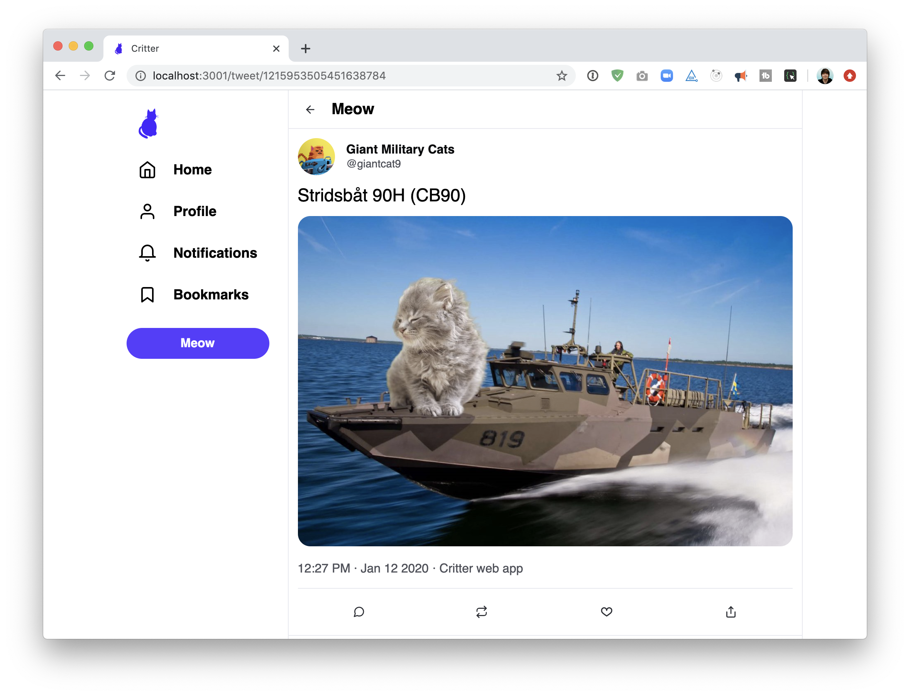

# Twitter project

## Twitter crash course

If you're not familiar with Twitter, this section helps describe the app.

Twitter is a social network/"micro-blogging" platform. You must be registered to post, but tweets are public and can be seen by non-registered users. Every twitter user chooses a username, often called a "handle". Conventionally, the handle is prefixed with an "@" symbol (eg. `@misswhatever`).

A "tweet" is a post, limited to 280 characters. Tweets can include media like photos or videos. Our clone will have limited media support.

Every profile as a "feed". A feed is a series of tweets. A user's profile feed shows all of the tweets they've posted, plus all of the tweets they've shared.

Users can follow each other. Unlike friends on facebook, following does not require mutual consent.

Every user has a "home feed". The home feed is a list of tweets that have been posted by the people that you follow. If you follow 100 accounts, your home feed will be a stream of tweets from those 100 people, along with things that those 100 people choose to "retweet".

A retweet is a way of sharing a tweet. If I follow `@koolkat`, and Kool Kat really likes Metallica, I may start seeing Metallica tweets in my home feed if Kool Kat retweets them.

---

## Functionality

Includes the following features:

### View a single tweet



When the user navigates to `/tweet/:tweetId`, they should see the details for the specified tweet.


---

### View a "home feed"

When navigating to the root URL `/`, the user should see a list of tweets from the accounts that the current user follows.


---

### View a profile page

When navigating to `/:profileId`, information about that user is displayed, above a list of that user's tweets (and retweets):


---

### Liking a tweet

When clicking the "like" button, it should increment the # of likes. Clicking again should "unlike" the tweet.


---

### Posting a new tweet

On the homepage, the user should be able to create a new tweet by writing in the box and clicking "Meow":


It should show up in the feed below after posting.


### Layout


You should now be able to click between different links in the left sidebar, which loads different (mostly empty) routes on the right:


## Tweet Components

There are two different Tweet components: a big one, used on the Tweet Details page, and a small one, to be used in different feeds.

### Big Tweet:


### Small Tweet:


You'll notice that these tweets share some UI elements in common, whereas other are different. If you try to create a single `Tweet` component, it will get awfully complicated. Might be better to have two separate components, but to share reusable bits (eg. maybe a `TweetActions` component for the row of icons along the bottom, since it's identical in both versions).

---

## Click targets

Twitter does something a little peculiar when it comes to click targets. Notice how the tweet itself is a `<Link>` to the `<TweetDetails />` page, and yet the user's display name is a `<Link>` to that user's profile:


---

## Character limit

Twitter allows tweets up to 280 characters. You should display a "remaining characters" indicator, which shifts colors as the user approaches/surpasses the limit:


Specifically, here are the rules:

- Should become yellow when 80% of the limit is used up (55 characters remaining)
- Should become red when the number dips into the negatives.
- Should not be able to submit a tweet that has exceeded the limit.

---

## Error screens


---

## Loading states

The initial loading experience should look something like this:


Note that there are two separate spinners shown.


---

## Time displays

The "small" version of the tweet uses the following date format:

```
Jan 12
```

The "large" version has more information:

```
9:38 AM · Jan 6 2020
```

The API returns the date in a different format:

```
timestamp: "2019-12-26T14:38:00+00:00"
```


---

## Refetching after tweeting

An easy thing to miss: after tweeting, your own new tweet should pop into the feed:


